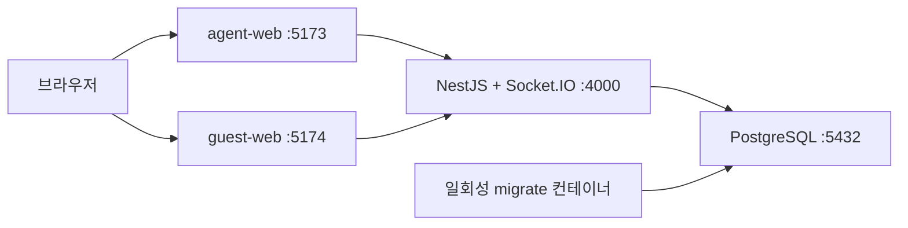
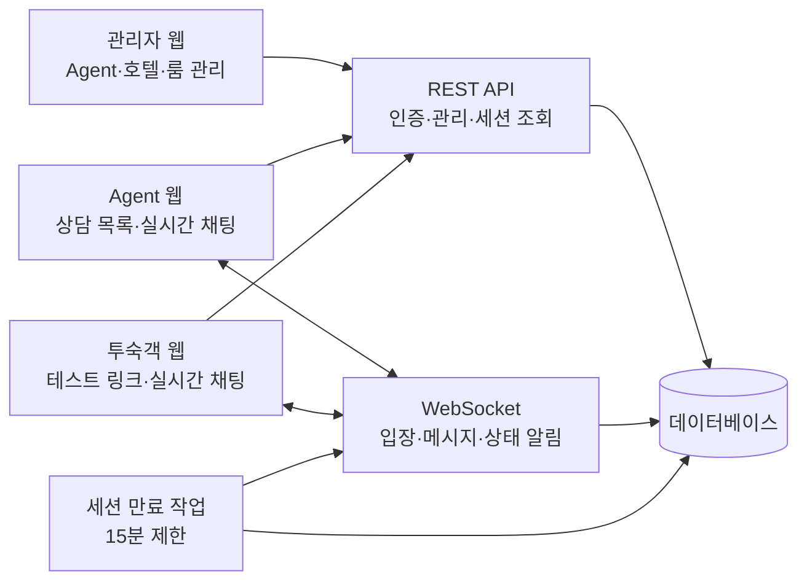
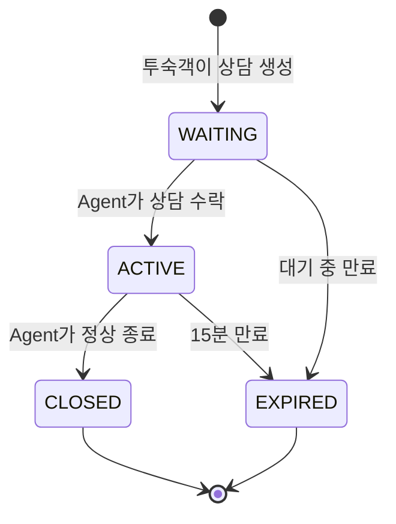
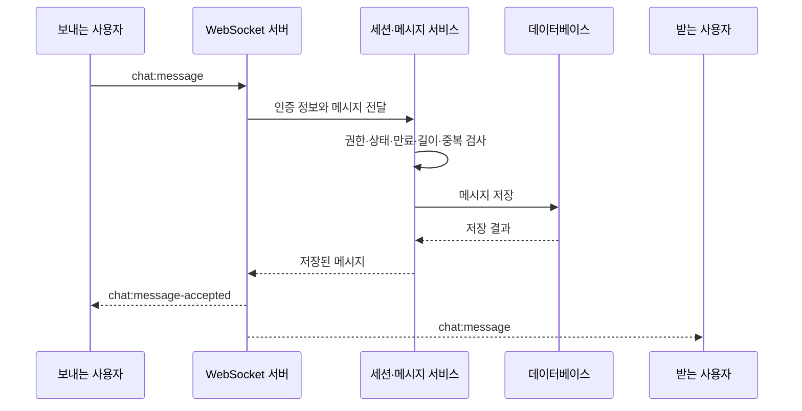
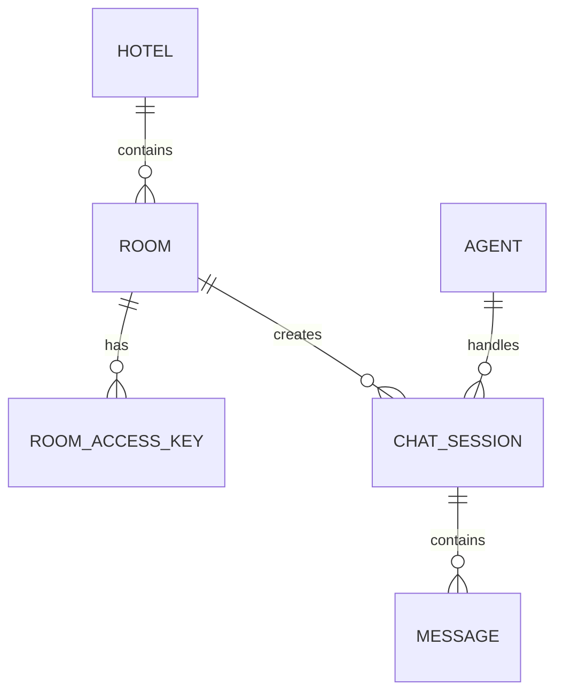
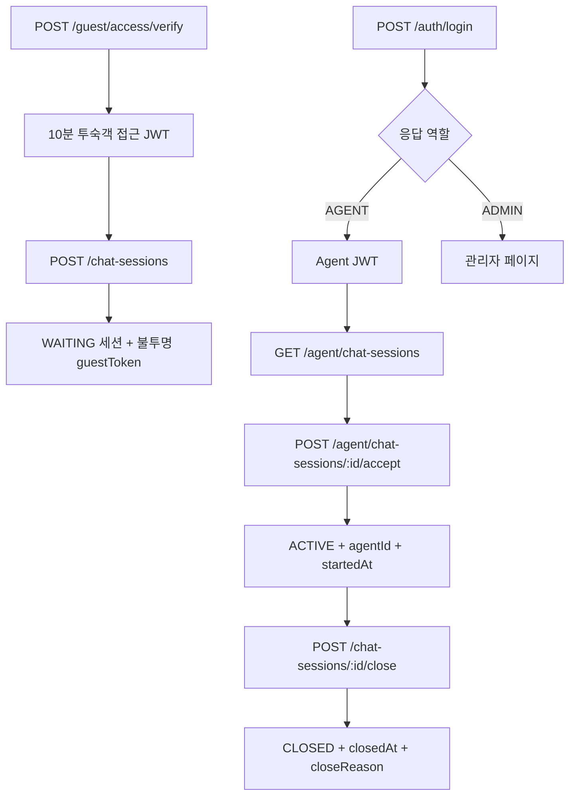
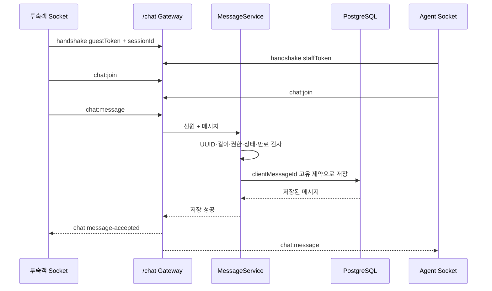
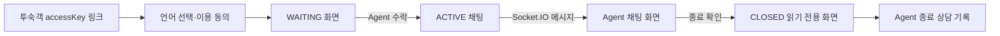

# 호텔–콜센터 채팅 시스템 설계도

## 1. 이 문서의 목적

이 문서는 프로그램을 처음 보는 사람이 각 화면, 서버 모듈, 데이터베이스와 실시간 이벤트가 어떻게 연결되는지 한눈에 이해하도록 돕는다. 상세 구현이 바뀌면 이 설계도도 함께 갱신한다.

## Docker 실행 구조와 룸 주소 생성

`docker compose up -d --build`는 웹 2개, API 서버, PostgreSQL을 같은 Docker 네트워크에 구성한다. `migrate` 컨테이너가 마이그레이션과 시드를 성공한 뒤 서버가 시작되므로 새 PC에서도 같은 순서로 초기화된다.

관리자가 룸을 추가하면 서버는 추측하기 어려운 접근키를 생성한다. 검증용 SHA-256 해시와 관리자 화면 복원용 AES-256-GCM 암호문만 DB에 저장한다. 관리자 API는 ADMIN 권한을 확인한 뒤 암호문을 복호화하여 `GUEST_PUBLIC_URL/?accessKey=...` 형식의 고객 주소를 돌려준다. 고객 접속 시에는 전달된 키의 해시로 룸을 검증한다.

## 2. 전체 구조

## 3. 화면 영역

### 관리자 페이지

- 공통 직원 로그인에서 ADMIN 역할 자동 이동과 권한 확인
- Agent 목록 및 추가
- 호텔 추가와 호텔 필터
- 호텔별 룸 추가 및 테이블 조회
- 룸별 고정 QR 미리보기와 약 1024px 고해상도 PNG 다운로드

QR은 관리자 브라우저에서 기존 고객 URL을 이미지로 변환하므로 서버 API·DB 스키마·저장 공간을 추가로 사용하지 않는다. 같은 고객 URL은 같은 QR 내용을 유지하며 정기 갱신하지 않는다. 상업 인쇄 전 장기간 유지할 고객 도메인을 확정해야 한다.

### Agent 페이지

- 공통 직원 로그인에서 AGENT 역할 자동 이동
- 반복 이동 기능이 없는 사이드바를 제외하고 로고·언어·계정 동작을 상단 헤더에 통합
- 대기 상담, 본인 진행 상담, 전 Agent 공동 완료 상담 로그
- 공동 로그 호텔별 필터와 높이 제한 내부 스크롤
- 상담 수락
- 실시간 메시지 송수신
- 객실, 언어, 상담 상태, 남은 시간 확인
- 상담 수동 종료

### 투숙객 페이지

- 테스트 링크 또는 접근 키 검증
- 새 상담 생성
- 상담원 연결 대기
- 실시간 메시지 송수신
- 연결 상태와 남은 시간 확인
- 종료 후 입력 차단

## 4. 서버 모듈 책임

| 모듈 | 주요 책임 |
|---|---|
| `auth` | 관리자·Agent 인증, 토큰 검증, 역할별 접근 제어 |
| `rooms` | 호텔, 룸, 룸 접근 키 관리 |
| `chat-sessions` | 상담 생성, 수락, 조회, 종료, 상태 전환 |
| `messages` | 메시지 검증, 저장, 조회, 중복 방지 |
| `realtime` | WebSocket 인증, 채팅방 입장, 이벤트 전달, 재연결 |
| `notifications` | 새 상담과 새 메시지의 화면 팝업, 선택형 알림음 및 브라우저 알림 |
| `operations` | 로그, 헬스 체크, 감사 기록 |
| `jobs` | 만료 대상 검색과 15분 자동 종료 |

## 5. 핵심 상담 상태

서버는 메시지를 저장하기 직전에 세션이 `ACTIVE`인지, 현재 시각이 `expiresAt` 이전인지 다시 확인한다. 화면의 타이머는 안내용이며 최종 판단 기준이 아니다.

## 6. 메시지 처리 흐름

## 7. 데이터 관계

구체적인 컬럼과 제약조건은 `04_Database_Design.md`에서 관리한다.

## 8. 반드시 지켜야 할 경계

- 관리자와 Agent API는 역할 권한을 분리한다.
- WebSocket 연결 시에도 REST 로그인과 독립적으로 토큰을 검증한다.
- 모든 채팅 이벤트는 요청자가 해당 세션에 참여할 권한이 있는지 확인한다.
- 메시지는 데이터베이스 저장 성공 후 상대방에게 전파한다.
- 종료 또는 만료된 세션은 REST와 WebSocket 양쪽에서 쓰기를 차단한다.
- 고정 QR은 고객 URL을 포함하므로 객실·접근 키 삭제 또는 고객 도메인 변경 시 기존 인쇄물이 무효화된다는 운영 경계를 관리자에게 안내한다.

## 9. Phase 1 실제 REST 처리 구조

상담 수락은 `status=WAITING`과 `agentId=null`을 조건으로 한 번에 갱신한다. 두 Agent가 동시에 수락하더라도 한 요청만 성공하도록 데이터베이스 갱신 결과 건수를 확인한다.

## 10. Phase 2 실시간 처리 구조

- Socket.IO 연결 미들웨어가 인증을 마쳐야 `connect`가 성공한다.
- 방 이름은 `session:{sessionId}`이며 권한 검사 후에만 입장한다.
- 메시지는 DB 저장 성공 후에만 전파한다.
- 같은 `sessionId + clientMessageId`는 기존 메시지를 반환하고 상대방에게 다시 방송하지 않는다.
- 재연결 후 `GET /chat-sessions/{id}/messages`로 누락 이력을 복구한다.

## 11. Phase 3 화면 상태와 데이터 흐름

- 투숙객 토큰·세션 ID·만료 시각은 접근 키별 `localStorage`에 저장해 탭 종료 후 같은 기기에서 QR을 다시 읽어도 열린 상담을 복구한다.
- 저장값은 브라우저 만료 시각과 서버 `GET /chat-sessions/:id` 검증을 모두 통과하고 상태가 `WAITING` 또는 `ACTIVE`일 때만 사용한다. 손상·만료·종료·인증 거부된 해당 접근 키 항목은 제거하고 신규 상담 동의 화면으로 복구한다.
- React 개발 모드의 중복 실행과 동시 요청에도 열린 상담이 두 개 생기지 않도록 클라이언트 실행 가드와 데이터베이스 부분 고유 인덱스를 함께 사용한다.
- Agent·관리자는 `POST /auth/login` 한 번으로 계정 역할을 판별하고 해당 페이지로 자동 이동한다. 인증은 역할별 키를 사용하는 탭 단위 `sessionStorage`에 두고 탭 종료 또는 로그아웃 때 제거한다. 24시간 콜센터 운영을 위해 직원 JWT 자체에는 만료 시각을 넣지 않되, 모든 REST·WebSocket 인증에서 현재 계정의 존재·활성 상태·역할을 DB로 다시 확인한다.
- 비밀번호 변경은 현재 비밀번호 bcrypt 검증 후 새 해시와 계정 `tokenVersion` 증가를 한 갱신에서 처리한다. 직원 JWT의 버전이 DB와 다르면 REST·WebSocket 모두 거부해 다른 PC에 남은 무기한 토큰도 폐기한다.
- 시드는 새 DB에만 기본 테스트 비밀번호를 만들고 기존 계정 비밀번호를 반복 덮어쓰지 않아 사용자가 변경한 값이 Docker·Render 재시작 후에도 유지된다.
- 남은 시간은 화면 안내용이며 최종 전송 가능 여부는 서버의 상태와 `expiresAt` 검사가 결정한다.
- Agent와 고객 채팅은 새 메시지·종료 이벤트마다 채팅 컨테이너만 마지막 메시지로 자동 스크롤하며, 상담 목록으로 돌아갈 때는 이전 페이지 위치를 복원한다.
- Agent 목록의 5초 폴링은 새 WAITING 상담 ID를 이전 목록과 비교해 화면 팝업을 발생시킨다. 해당 Agent에게 배정된 모든 ACTIVE 상담은 알림 전용 Socket.IO 연결이 방에 입장하며, 고객 메시지 수신 즉시 현재 열어 둔 상담과 관계없이 별도 팝업을 발생시킨다. 알림음은 기본 꺼짐이며 Agent가 켠 경우에만 재생한다.
- Agent 탭·창이 비활성이면 새 상담 또는 고객 메시지 알림 시 `document.title`을 1초 간격으로 교대하고, `visibilitychange` 또는 창 `focus`에서 원래 제목과 타이머를 복구한다.
- 메시지 저장 트랜잭션은 해당 세션의 `lastActivityAt`을 메시지 생성 시각으로 함께 갱신한다. 상담 목록 API는 전체 메시지를 반복 집계하지 않고 인덱스가 있는 이 컬럼으로 바로 정렬하며, Agent 진행 목록은 Socket 수신 직후에도 로컬 값을 먼저 갱신한다.
- 시스템 알림은 브라우저 권한이 `granted`이고 Agent 탭이 백그라운드일 때만 표시하며, 권한 거부나 미지원 환경에서도 화면 팝업은 항상 유지한다.
- 640px 이하에서는 상담·관리 표를 카드 목록으로 바꾸고 채팅 화면은 `100dvh`와 모바일 안전 영역을 사용한다.

## 12. 관리자와 운영 안정성

- 공통 로그인은 계정 역할을 응답하지만 `/admin/*` API는 별도로 ADMIN 역할만 허용하고 Agent 토큰은 거부한다.
- 관리자 API는 Agent 비밀번호를 bcrypt로 해시하고 응답에서는 해시를 제외한다.
- 서버는 시작 직후와 5초마다 만료 대상을 DB에서 조회해 `EXPIRED`로 원자 전환하고 Socket.IO 종료 이벤트를 보낸다.
- 종료된 상담 기록은 `closedAt` 기준 30일 보존하며 서버 시작 후 1회와 이후 24시간마다 한 번의 인덱스 삭제 쿼리로 정리한다. 세션 삭제 시 메시지는 DB 연쇄 삭제한다.
- REST는 IP·메서드·경로별 분당 제한, WebSocket 메시지는 연결별 분당 60개 제한을 적용한다.
- 헬스 체크는 프로세스뿐 아니라 PostgreSQL의 `SELECT 1` 결과까지 검사한다.
- 로그인, 수락, 종료, 만료는 검색 가능한 JSON 구조 로그로 남긴다.
