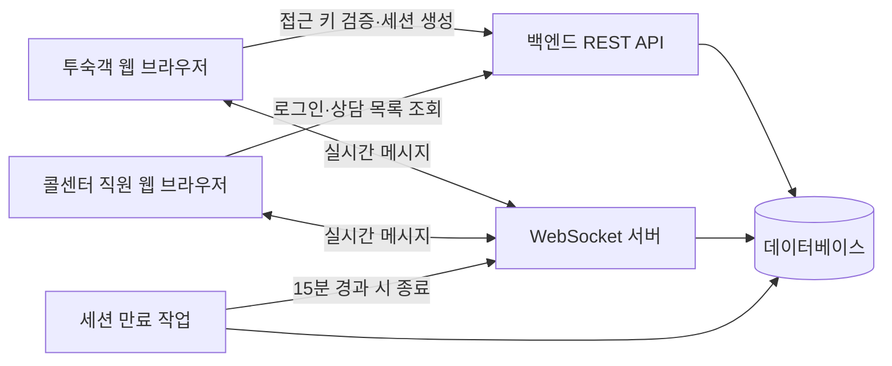
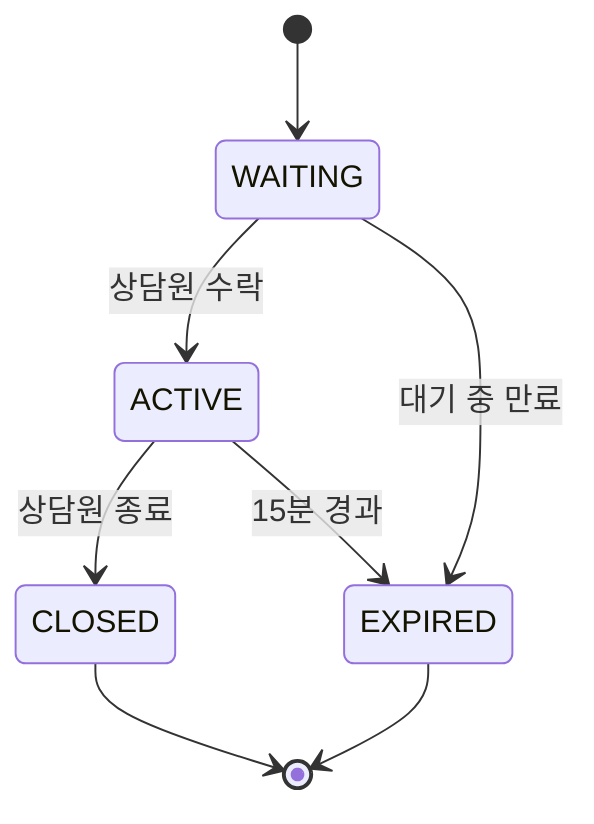
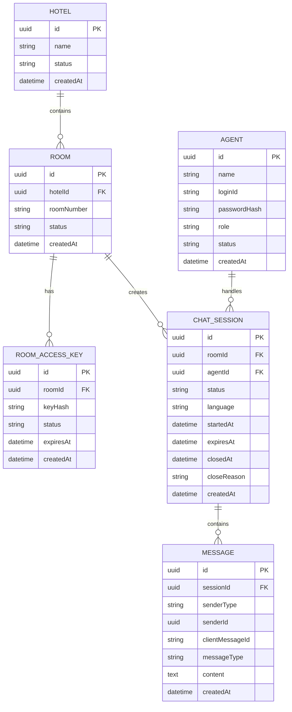
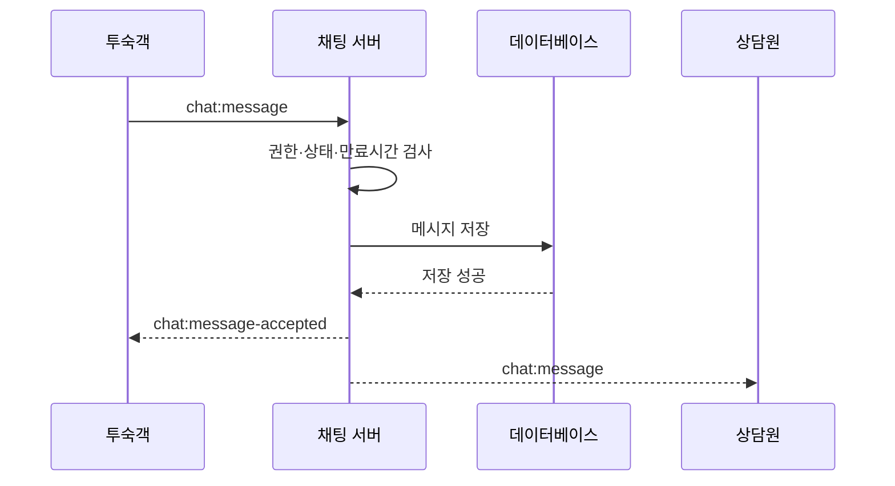
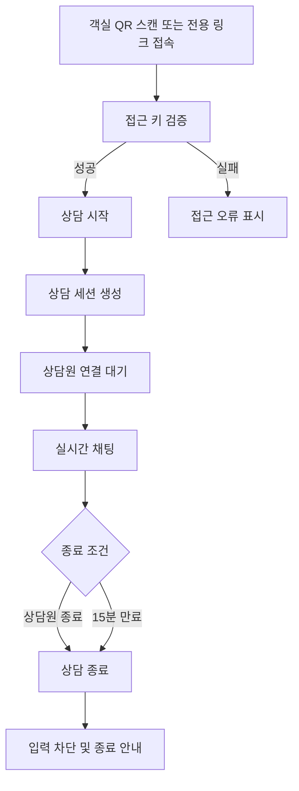
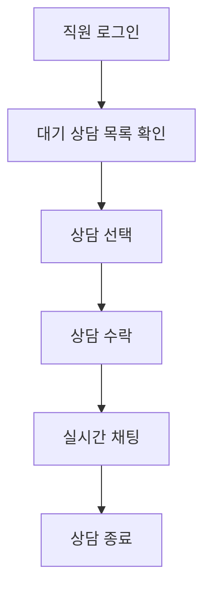

# 호텔–콜센터 채팅 시스템 MVP 설계안

## 문서 정보

- 문서명: 호텔–콜센터 채팅 시스템 MVP 설계안
- 목적: 객실 QR 코드로 접속한 투숙객과 콜센터 직원이 최대 15분 동안 안전하게 실시간 텍스트 상담을 진행할 수 있는 MVP 정의
- 문서 상태: 초기 사양서
- 작성 형식: Markdown

---

## 1. 시스템 목적

호텔 객실에 인쇄하여 비치한 고정 QR 코드 또는 전용 링크를 통해 투숙객이 별도의 앱 설치나 회원가입 없이 콜센터 직원과 실시간으로 채팅할 수 있도록 한다. QR 코드는 객실 생성 때 한 번 발급된 고객 전용 URL을 그대로 담으며 별도의 유효기간이나 정기 갱신을 두지 않는다.

채팅 세션은 객실을 기준으로 생성하며, 한 번의 상담은 최대 15분 동안만 사용할 수 있다. 상담원이 종료하거나 제한 시간이 지나면 해당 세션에서는 더 이상 메시지를 보낼 수 없어야 한다.

### MVP 목표

> 객실별 고정 QR 코드 또는 전용 링크로 접속한 투숙객과 로그인한 콜센터 직원이 최대 15분 동안 안전하게 실시간 텍스트 상담을 진행할 수 있다.

---

## 2. 전체 시스템 구성



---

## 3. 전체 시스템에서 필요한 기능

### 3.1 투숙객 기능

#### 접속

- 객실 QR 코드 스캔
- 전용 링크 접속
- 객실 또는 접근 키 유효성 확인
- 회원가입 없이 상담 시작
- 사용 언어 선택(일본어 기본, 일본어·영어·한국어·중국어 지원)
- 이용 안내 및 개인정보 안내 확인

#### 채팅

- 텍스트 메시지 전송
- 콜센터 메시지 실시간 수신
- 메시지 전송 상태 표시
- 연결 상태 표시
  - 연결됨
  - 연결 끊김
  - 재연결 중
- 상담 시작 시각 표시
- 남은 상담 시간 표시
- 상담 종료 안내 표시

#### 사용 제한

- 15분 경과 후 메시지 전송 차단
- 종료된 세션 재사용 차단
- 동일 객실의 과도한 세션 생성 차단
- 비정상적인 반복 메시지 차단
- 너무 긴 메시지 차단
- 허용되지 않은 데이터 형식 차단

#### 향후 확장

- 이미지 및 파일 전송
- 자동 번역
- 자주 묻는 질문 버튼
- 객실 서비스 요청
- 상담 만족도 평가
- 음성 입력
- 음성 통화 연결
- 챗봇의 1차 응답
- 이전 메시지 임시 복구

### 3.2 콜센터 직원 기능

#### 상담 관리

- 대기 중인 상담 목록 확인
- 진행 중인 상담 목록 확인
- 종료된 상담 목록 확인
- 새로운 상담 도착 확인
- 상담 선택 및 입장
- 투숙객 메시지 실시간 수신
- 답변 메시지 전송
- 상담 종료

#### 상담 화면 정보

- 객실 식별 정보
- 상담 시작 시각
- 남은 시간
- 사용 언어
- 현재 연결 상태
- 상담 담당자
- 상담 상태

#### 알림

- 새로운 상담 요청 표시
- 새로운 메시지 표시
- 브라우저 알림
- 알림음
- 화면 팝업
- 미응답 상담 강조 표시

#### 향후 운영 기능

- 상담 담당자 배정
- 상담 인계
- 상담 메모
- 상담 분류
- 긴급 상담 표시
- 금지 사용자 또는 객실 차단
- 상담 내역 검색
- 통계 확인
- 다수 상담 동시 처리
- 답변 템플릿
- 상담원 상태 설정
- 관리자 호출
- AI 답변 추천

### 3.3 관리자 기능

- 관리자 페이지와 Agent 페이지는 별도의 진입 경로와 권한으로 구분
- 관리자 페이지에서 콜센터 Agent 추가 및 계정 관리
- 호텔 및 객실 등록
- Agent 삭제와 룸 삭제
- 호텔 삭제 시 소속 룸·접근키·상담·메시지 연쇄 삭제
- 호텔 선택 필터로 룸 목록 조회
- 룸 목록을 테이블 형태로 표시
- 객실별 접근 키 생성
- 객실별 QR 코드 생성
- 룸 테이블 마지막 열의 QR 버튼으로 QR 코드 확인
- QR 코드 이미지 다운로드
- QR 코드에 포함되는 운영 고객 도메인 확인 안내
- 콜센터 직원 계정 관리
- 직원 권한 관리
- 상담 가능 시간 설정
- 최대 상담 시간 설정
- 메시지 길이 제한 설정
- 세션 생성 제한 설정
- 금지어 설정
- 시스템 공지 등록
- 상담 기록 및 통계 조회
- 감사 로그 조회
- 장애 및 접속 상태 확인

### 3.4 서버 기능

#### 인증 및 권한

- 투숙객 접근 키 검증
- 콜센터 직원 로그인
- 관리자 로그인
- 역할별 접근 권한 확인
- 세션 토큰 발급
- 만료된 토큰 차단

#### 상담 세션 관리

- 새 상담 세션 생성
- 세션 상태 관리
- 상담 시작 및 만료 시각 기록
- 15분 경과 시 자동 종료
- 상담원의 수동 종료
- 연결 종료 시 상태 처리
- 중복 세션 생성 제한

#### 메시지 관리

- 메시지 유효성 검사
- 발신자 및 접근 권한 확인
- 메시지 저장
- 실시간 메시지 전달
- 메시지 순서 유지
- 중복 메시지 방지
- 종료된 세션의 메시지 차단

#### 보안

- 서버 측 15분 제한 검증
- 요청 횟수 제한
- SQL 인젝션 방지
- XSS 방지
- CSRF 대응
- 접근 키 추측 공격 방지
- 인증되지 않은 WebSocket 연결 차단
- 관리자 API 접근 제한
- 주요 작업 로그 기록

#### 운영 안정성

- 연결 끊김 감지 및 재연결
- 서버 및 데이터베이스 오류 처리
- 헬스 체크
- 백업 및 장애 복구
- 상담 만료 작업 실행

---

## 4. MVP 포함 범위

### 4.1 투숙객 MVP

- 테스트용 전용 링크 또는 접근 키로 채팅 페이지 접속
- 객실 접근 키 검증
- 새 상담 세션 생성
- 텍스트 메시지 송수신
- 연결 상태 표시
- 남은 상담 시간 표시
- 상담 종료 상태 표시
- 종료 후 입력 차단
- 기본 오류 메시지 표시

### 4.2 콜센터 MVP

- 직원 로그인
- 대기 중인 상담 목록 확인
- 상담 선택 및 수락
- 투숙객과 메시지 송수신
- 객실 식별 정보 확인
- 상담 시작 시간 및 남은 시간 확인
- 상담 종료 버튼
- 새로운 상담 또는 메시지의 화면상 표시
- 간단한 알림음
- 새 상담과 고객 메시지를 8초 동안 표시하는 화면 우측 상단 팝업
- 사용자가 권한을 허용한 경우 Agent 탭이 백그라운드일 때 브라우저 시스템 알림

### 4.3 서버 MVP

- 객실 접근 키 검증 API
- 상담 세션 생성·조회·종료 API
- WebSocket 연결
- 메시지 송수신 및 저장
- 세션 만료 처리
- 직원 인증과 권한 검사
- 요청 횟수 제한
- 서버 측 입력값 검사
- 기본 로그 기록

### 4.4 관리자 MVP

초기 화면은 관리자 페이지와 Agent 페이지로 분리한다. 관리자 페이지는 다음 최소 관리 기능을 포함한다.

- 관리자 인증 및 Agent 페이지와의 권한 분리
- 현재 무료 테스트 배포의 고정 계정은 관리자 `admin / admin`, Agent `agent01 / agent01`을 사용하고 비밀번호 길이·문자 조합은 제한하지 않되 DB에는 bcrypt 해시로만 저장
- Agent 추가 및 기본 계정 목록 조회
- Agent 삭제(기존 상담 기록의 담당자 관계는 제거하되 상담 기록은 보존)
- 호텔 추가 및 호텔별 룸 추가
- 룸 삭제와 호텔 단위 하위 데이터 전체 삭제
- 호텔 필터를 이용한 룸 목록 조회
- 룸 정보를 테이블 형태로 표시
- 룸별 고정 QR 코드 미리보기 및 PNG 다운로드

룸 테이블의 QR 버튼은 기존 고객 URL을 브라우저에서 QR 이미지로 변환해 미리보기와 PNG 다운로드를 제공한다. QR 정보는 서버나 데이터베이스에 중복 저장하지 않는다. 객실이나 고객 URL을 삭제하지 않는 한 같은 QR을 계속 사용할 수 있으며, 정기 갱신·폐기·재발급 UI는 제공하지 않는다.

---

## 5. MVP 제외 범위

- QR 코드 삭제, 폐기 및 재생성
- 이미지 및 파일 전송
- 음성·영상 통화
- 자동 번역
- AI 챗봇 및 답변 추천
- 상담원 자동 배정과 인계
- 만족도 조사
- 복잡한 통계 대시보드
- 모바일 앱
- LINE 연동
- 이메일·SMS·운영체제 푸시 알림
- 다중 호텔 관리 화면
- 정교한 관리자 페이지
- 객실 서비스 주문
- 결제
- 장기간 상담 내역 보존

---

## 6. 모듈 구조

```text
호텔 채팅 시스템
│
├─ 인증 모듈
│  ├─ 직원 인증
│  ├─ 관리자 인증
│  └─ 투숙객 접근 키 검증
│
├─ 객실 모듈
│  ├─ 호텔 정보
│  ├─ 객실 정보
│  └─ 객실 접근 키
│
├─ 상담 세션 모듈
│  ├─ 세션 생성
│  ├─ 세션 조회
│  ├─ 상태 변경
│  └─ 만료 처리
│
├─ 메시지 모듈
│  ├─ 메시지 저장
│  ├─ 메시지 조회
│  └─ 메시지 검증
│
├─ 실시간 통신 모듈
│  ├─ WebSocket 연결
│  ├─ 채팅방 입장
│  ├─ 메시지 전달
│  └─ 재연결
│
├─ 알림 모듈
│  ├─ 화면 알림
│  ├─ 알림음
│  └─ 향후 푸시 알림
│
└─ 운영 모듈
   ├─ 로그
   ├─ 통계
   ├─ 장애 확인
   └─ 감사 기록
```

각 기능은 역할별로 분리한다. 예를 들어 메시지 저장 코드 안에서 번역 기능을 직접 실행하지 않고, 향후 별도의 번역 모듈을 호출할 수 있도록 구성한다.

---

## 7. 상담 상태 설계

```text
WAITING     상담원이 입장하기 전
ACTIVE      상담 진행 중
CLOSED      상담원이 정상 종료
EXPIRED     제한 시간이 지나 자동 종료
CANCELLED   상담 시작 전 취소
BLOCKED     관리 정책에 의해 차단
```

### MVP 상태 전환



`CANCELLED`와 `BLOCKED`는 데이터 구조에는 정의하되 관리 기능은 이후 버전에서 구현한다.

---

## 8. 메시지 상태 설계

전체 후보 상태:

```text
PENDING
SENT
DELIVERED
READ
FAILED
```

MVP 구현 상태:

```text
SENT
FAILED
```

향후 `DELIVERED`, `READ` 상태를 추가할 수 있도록 모든 메시지는 고유 ID와 생성 시각을 가진다.

---

## 9. 기본 데이터 구조

### Hotel

```text
id
name
status
createdAt
```

### Room

```text
id
hotelId
roomNumber
status
createdAt
```

### RoomAccessKey

```text
id
roomId
keyHash
status
expiresAt
createdAt
```

접근 키 원문은 데이터베이스에 그대로 저장하지 않고 해시 형태로 저장한다.

### Agent

```text
id
name
loginId
passwordHash
role
status
createdAt
```

### ChatSession

```text
id
roomId
agentId
status
language
startedAt
expiresAt
closedAt
closeReason
createdAt
```

### Message

```text
id
sessionId
senderType
senderId
clientMessageId
messageType
content
createdAt
```

MVP에서는 `messageType`으로 `TEXT`만 사용한다.

향후 후보:

```text
TEXT
IMAGE
FILE
SYSTEM
TRANSLATION
```

---

## 10. 데이터베이스 관계 초안



---

## 11. MVP API 초안

### 투숙객 접근 확인

```http
POST /api/guest/access/verify
```

### 상담 세션 생성

```http
POST /api/chat-sessions
```

### 상담 세션 조회

```http
GET /api/chat-sessions/{sessionId}
```

### 이전 메시지 조회

```http
GET /api/chat-sessions/{sessionId}/messages
```

### 상담 종료

```http
POST /api/chat-sessions/{sessionId}/close
```

### 콜센터 로그인

```http
POST /api/auth/agent/login
```

### 상담 목록 조회

```http
GET /api/agent/chat-sessions
```

### 상담원 수락

```http
POST /api/agent/chat-sessions/{sessionId}/accept
```

### WebSocket 이벤트

```text
chat:join
chat:message
chat:message-accepted
chat:session-updated
chat:session-closed
chat:error
```

---

## 12. 메시지 전송 시퀀스



---

## 13. 서버 검증 원칙

프론트엔드에서 입력창을 막는 것만으로는 보안 기능이 되지 않는다. 사용자는 개발자 도구나 직접 작성한 요청으로 화면 제한을 우회할 수 있다.

서버는 메시지를 처리하기 전에 반드시 다음을 확인한다.

- 세션이 존재하는가
- 요청자가 해당 세션에 접근할 권한이 있는가
- 세션 상태가 메시지를 보낼 수 있는 상태인가
- 현재 시각이 `expiresAt` 이전인가
- 메시지 길이가 제한 이내인가
- 요청 횟수가 지나치게 많지 않은가
- 동일한 메시지가 중복 전송된 것은 아닌가

프론트엔드는 사용자 편의를 위해 제한하고, 서버는 실제 보안을 위해 최종적으로 요청을 거절한다.

---

## 14. MVP 사용자 흐름

### 초기 화면 구성

초기 운영 화면은 역할에 따라 다음 두 영역으로 구분한다.

```text
운영 웹
├─ 관리자 페이지
│  ├─ 관리자 로그인
│  ├─ Agent 관리
│  │  ├─ Agent 목록
│  │  └─ Agent 추가
│  └─ 호텔·룸 관리
│     ├─ 호텔 추가 및 선택 필터
│     ├─ 룸 추가
│     └─ 룸 테이블
│        └─ 고정 QR 미리보기·PNG 다운로드
└─ Agent 페이지
   ├─ Agent 로그인
   ├─ 대기·진행·종료 상담 목록
   └─ 실시간 상담 화면
```

룸 테이블의 QR 버튼을 누르면 해당 룸의 고객 URL을 담은 고정 QR 코드를 확인하고 PNG 이미지로 다운로드할 수 있다. 인쇄물은 해당 고객 URL과 강하게 결합되므로 상업 인쇄 전에 장기간 유지할 운영 고객 도메인을 확정하고 실제 휴대전화로 스캔 시험을 완료해야 한다. QR은 객실 또는 접근 키가 삭제되지 않는 한 만료되지 않으며 정기 갱신하지 않는다.

### 투숙객



### 콜센터 직원



---

## 15. MVP 완료 기준

1. 유효한 테스트용 링크 또는 접근 키로 투숙객 화면에 접속할 수 있다.
2. 유효하지 않은 접근 키는 서버에서 거부한다.
3. 투숙객이 새로운 상담 세션을 만들 수 있다.
4. 콜센터 직원이 대기 상담을 확인할 수 있다.
5. 양쪽에서 실시간 텍스트 메시지를 주고받을 수 있다.
6. 새로고침하거나 잠시 연결이 끊겨도 진행 중인 상담으로 재접속할 수 있다.
7. 세션별 메시지가 서로 섞이지 않는다.
8. 15분이 지나면 서버가 세션을 자동 종료한다.
9. 종료된 세션에서는 추가 메시지를 보낼 수 없다.
10. 콜센터 직원이 상담을 직접 종료할 수 있다.
11. 인증되지 않은 사용자는 콜센터 화면에 접근할 수 없다.
12. 과도한 메시지 요청을 서버가 제한한다.
13. 서버 오류가 다른 상담 세션에 영향을 주지 않는다.
14. 주요 오류와 상담 상태 변경이 로그에 남는다.

---

## 16. 개발 우선순위

### 1단계: 핵심 데이터와 API

- 데이터베이스 테이블
- 객실 접근 키 검증
- 상담 세션 생성
- 상담 세션 상태 변경
- 직원 로그인

### 2단계: 실시간 채팅

- WebSocket 연결
- 채팅방 입장
- 메시지 전송
- 메시지 저장
- 연결 끊김 및 재연결

### 3단계: 화면

- 투숙객 채팅 화면
- 관리자 로그인 및 Agent 추가 화면
- 호텔·룸 추가, 호텔 필터 및 룸 테이블 화면
- 콜센터 로그인 화면
- 상담 목록 화면
- 콜센터 채팅 화면

### 4단계: 제한 및 보안

- 15분 자동 만료
- 메시지 길이 제한
- 요청 횟수 제한
- 권한 검사
- 중복 메시지 방지

### 5단계: 운영 테스트

- 여러 객실 동시 상담
- 연결 끊김 테스트
- 세션 만료 테스트
- 서버 재시작 테스트
- 잘못된 접근 키 테스트
- 비정상 요청 테스트

---

## 17. 권장 문서 구조

```text
hotel-chat-system/
│
├─ README.md
├─ docs/
│  ├─ 01_MVP_Requirements.md
│  ├─ 02_System_Architecture.md
│  ├─ 03_User_Flows.md
│  ├─ 04_Database_Design.md
│  └─ 05_API_Specification.yaml
│
└─ design/
   └─ Figma 화면 설계 링크
```

이 문서는 초기에는 하나의 통합 설계안으로 사용하고, 개발이 시작되면 요구사항·아키텍처·사용자 흐름·DB·API 문서로 분리한다.
